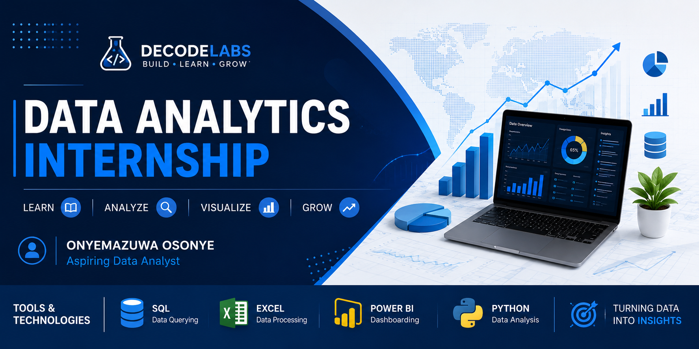

# 📊 DecodeLabs Data Analytics Internship

<p align="center">
  
</p>

## 🚀 Overview

Welcome to my DecodeLabs Data Analytics Internship repository.

This repository serves as a portfolio of my learning journey, projects, assignments, and practical exercises completed during the internship. 
It showcases my progress in developing analytical skills and applying data-driven solutions to real-world business problems.

---

## 🎯 Internship Objectives

Throughout this internship, I aim to:

* Develop strong Data Analytics skills
* Master SQL for querying and managing data
* Improve data cleaning and transformation techniques
* Build interactive Power BI dashboards
* Perform Exploratory Data Analysis (EDA)
* Generate actionable business insights from data
* Build a professional portfolio of analytics projects

---

## 🛠 Tools & Technologies

* Postgre SQL
* Microsoft Excel
* Power BI
* Python
* Git & GitHub

---

## 📚 Skills Being Developed

* Data Cleaning & Preparation
* Data Transformation
* SQL Querying
* Database Management
* Data Visualization
* Dashboard Development
* Exploratory Data Analysis (EDA)
* Business Intelligence Reporting
* Insight Generation

---

## 📂 Repository Structure

```text
DecodeLabs-Internship/
│
├── assets/
│   └── banner.png
│
├── Week-01/
├── Week-02/
├── Week-03/
├── Week-04/
│
├── SQL/
├── Dashboards/
├── Datasets/
├── Documentation/
├── Projects/
│
└── README.md
```

---

## 📈 Learning Journey

This repository will be updated regularly with:

* Weekly internship assignments
* SQL practice exercises
* Data cleaning projects
* Dashboard development tasks
* Business case studies
* Data analysis reports
* Final internship projects

---

## 🏆 Current Focus Areas

* SQL for Data Analysis
* Excel Data Processing
* Power BI Dashboard Design
* Python Data Cleaning & Validation
* Business Reporting
* Data Visualization

---

## 👨‍💻 About Me

**Onyemazuwa Osonye**

Aspiring Data Analyst passionate about transforming raw data into meaningful insights using SQL, Excel, Power BI, and Python.

---

## 📌 Repository Status

🚧 Currently in Progress

This repository will continue to grow as I complete tasks, projects, and challenges throughout the DecodeLabs Data Analytics Internship.

---

## 🙏 Acknowledgements

Special thanks to DecodeLabs for providing an opportunity to gain hands-on experience in Data Analytics and build industry-ready skills through practical learning.
